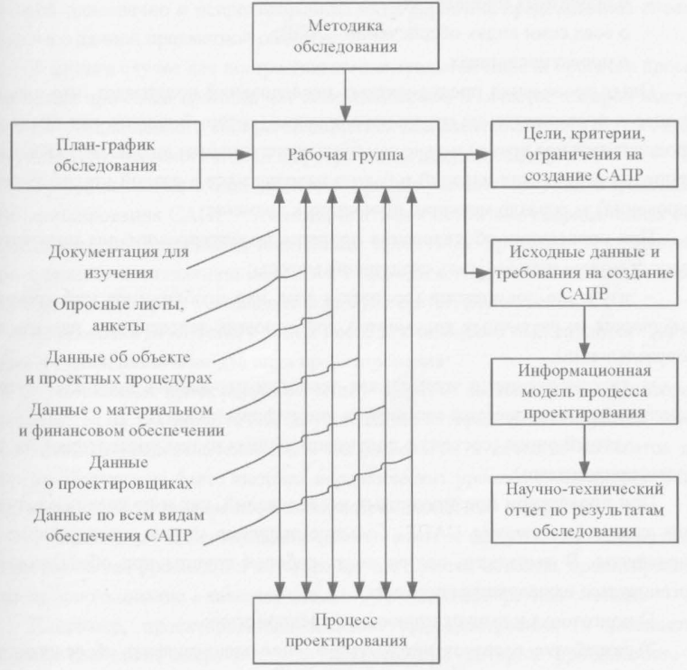

___
# Вопрос 14: Каков порядок подготовки предприятия к внедрению ИТ?
___

Эффективность системного анализа процесса проектирования в целях внедрения САПР в значительной степени зависит от организации работ по его обследованию. Для проведения работ на данном этапе формируется рабочая группа, которая руководствуется приказом руководителя предприятия, в котором должны быть определены: 

- состав обследуемых подразделений, занятых проектированием конкретных изделий;

- состав исполнителей, участвующих в обследовании;

- обязанности, выполняемые каждым подразделением и исполнителем, проводящим обследование;

- сроки проведения обследования и порядок представления результатов работы.

Обследование выполняется специалистами подразделений предприятия, в число которых включаются:

- разработчики САПР;

- опытные специалисты по соответствующему направлению техники.

При анализе автоматизации процесса проектирования определяют: количественные и качественные характеристики управляемой и управляющей подсистем, целесообразность внедрения ИТ и степень подготовленности соответствующей подсистемы для ее дальнейшего совершенствования.

Системный анализ процесса проектирования с целью внедрения ИТ удобно разделить на внешний и внутренний:

- основные задачи *внешнего* анализа процесса проектирования следующие: определение ее организационной структуры и перечня проектных процедур, выполняемых в ней; выявление связей между управляющей и управляемой подсистемами; построение или корректировка модели управляемой подсистемы;

- на этапе *внутреннего* анализа процесса проектирования решаются задачи построения моделей конкретных проектных процедур, выделенных в качестве типовых; определение их технико-экономических характеристик с учетом всей входной и выходной документации, а также технологии проектирования и испытаний.

Ниже представлена очень подробная информация об этапах *внешнего* и *внутреннего* анализа.

---

**Этапы *внешнего* анализа**:

1 ШАГ

- раскрытие организационной структуры подразделений предприятия, занятых разработкой схем, конструкторским и технологическим проектированием, а также испытаниями опытных образцов;

- выявление технико-экономической информации об имеющихся на предприятии технических средствах, программно-методических комплексах и пакетах прикладных программ.

При этом прослеживаются пути прохождения информации от подразделения к подразделению, а также производится анализ этих путей для получения ответов на следующие вопросы:

- какие данные передаются по линиям связи локальной вычислительной сети, а какие с помощью документов на бумажных и машинных носителях;

- каковы фактические сроки передачи данных;

- какая информация не находит своих получателей в других подразделениях предприятия.

Информационный анализ целесообразно разбить на следующие операции:

- составление перечня проектируемых изделий в целом и их составных частей;

- составление перечня проектных процедур (операций);

- составление полного перечня входной и выходной информации;

- классификация информации;

- выявление избыточной информации и дублирующих связей и циклов.

Техническую документацию классифицируют по следующим видам:

- входная документация;

- выходная документация;

- документация, вырабатываемая в результате выполнения проектных процедур;

- внутренняя документация, используемая исключительно внутри подразделений предприятия.

Результаты анализа удобно заносить в специальные формы, которые затем могут быть закодированы и храниться в памяти ЭВМ.

В результате выполнения первого шага внешнего анализа получают структурную схему управляемой подсистемы с привязкой к конкретным подразделениям предприятия.

2 ШАГ

- рассматриваются проектные процедуры, выполняемые в подразделениях предприятия;

- определяются типы проектных процедур и их количество по типам.

Классификация проектных процедур производится по признакам:

- сходства характера исходных данных и результатов, получаемых при выполнении различных проектных процедур;

- сходства категорий проектировщиков: разработчиков, конструкторов, технологов и испытателей.

Для составления перечня типовых проектных процедур анализируется проектная документация, входящая в проект. При этом учитываются такие технико-экономические характеристики, как:

– временные и финансовые затраты;

– объемы и виды информации, переработанной в процессе выполнения проектной процедуры.

На данном этапе обследования не требуется знать характеристики проектных процедур с точностью большей, чем это необходимо для их качественного предварительного сравнения по вкладу в процесс проектирования.

3 ШАГ

Построение информационной модели системы проектирования, которая, по существу, представляет собой интегральное отображение результатов, полученных на предыдущих шагах.

На данном шаге целесообразно использовать итеративный процесс последовательного приближения. Каждая итерация такого процесса связана с получением информации об объекте и процессе проектирования при различной степени их дифференциации, например:

- на первой итерации может быть получена информация об объекте в целом без его расчленения;

- на второй итерации – о структурной схеме объекта; на третьей – о связях составных частей объекта и т. д.

Информационная модель также является основой для создания модели предметной области для обследуемого процесса проектирования.

---

Этапы *внутреннего* анализа 

На этом этапе уточняется и детализируется информация о процессе проектирования, полученная на этапе внешнего анализа.

1 ШАГ 

Выделение из каждой группы:

- проектных процедур, полученных в результате классификации на этапе внешнего анализа;

- типовых проектных процедур, называемых проектными процедурами-представителями.

Выбор таких процедур осуществляется, как правило, экспертным путем.

2 ШАГ

Для всех процедур-представителей определяются:

- количественные оценки;

- временные оценки.

Такие оценки осуществляются либо экспертным путем, либо методом хронометражных наблюдений (при этом последний позволяет получить более точные данные о проектных процедурах по сравнению с методом экспертных оценок).

На этом этапе также уточняются структура и объем информации, используемой в процессе проектирования, в том числе и нормативно-справочной документации. Эти сведения впоследствии используются при разработке баз данных ИТ (САПР, АСТПП).

Вся информация, полученная в результате внутреннего анализа, заносится в специальные формы, которые затем кодируются и хранятся в памяти ЭВМ.

Таким образом, внутренний анализ завершается получением интегральных характеристик по трудоемкости, длительности и ряду других параметров выполнения типовых проектных процедур-представителей. На основе внешнего и внутреннего анализа оценивается стратегия внедрения САПР. При этом выявляют:

- объекты автоматизации (проектные процедуры);

- состояние технических средств автоматизации проектных процедур;

- уровень автоматизации проектных процедур;

- уровень унификации и стандартизации конструкторско-технологических решений.

---

В части составляющей ИТ – САПР по результатам дается принципиальная оценка необходимости разработки новой САПР либо совершенствования существующих инструментов САПР. При этом необходимо оценить уровень подготовленности предприятия по следующим показателям:

- обеспеченность специалистами, имеющими опыт работы с инструментами САПР;

- наличие необходимых технических средств САПР;

- возможность финансирования работ по САПР;

- соответствие организационной структуры предприятия условиям применения САПР.

На рисунке представлена схема организации выполнения системного анализа процесса проектирования.

