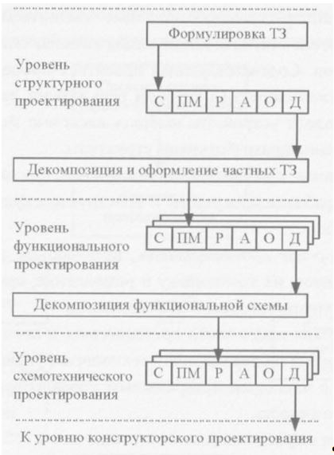
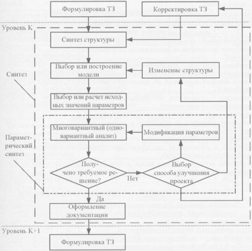

___
# Вопрос 16:	Каким образом осуществляется декомпозиция процессов проектирования и производства на отдельные процедуры?
___

*Источники: Тема 3.doc, Лекция 3*

### Декомпозиция со слов Сольницева
Декомпозиция процессов на предприятии на отдельные процедуры складывается традиционно на протяжении 10 лет. 
Пример, Электроавтоматика – сложилось представление отдельных подразделений, каждое из которых занимается своим делом. 
Кто-то делает аппаратную часть, кто-то программное обеспечение, кто-то обеспечивает испытание готовой ЭВМ перед сдачей заказчику, конструкторское подразделение.
На входе получает принципиальную эл.схему, на выходе выдает конструкторскую документацию. 
Распределение проекта по подразделением и есть декомпозиция.

### Декомпозиция в лекциях
В процессе проектирования сверху-вниз изделие наибольшего уровня сложности разбивается (декомпозируется) на составные части (узлы, устройства, компоненты).
При этом для каждой составной части изделия, которую требуется спроектировать, формируется частное техническое задание.
На уровне структурного проектирования производится декомпозиция и оформление частных технических заданий. 
Все изделие как правило разбивается на отдельные подсиситеы, узлы и детали. 
Например, на арифметическо-логический блок, долговременную память, быструю память, устройства ввода/вывода, вспомогательные блоки. А также программное обеспечение. 
На каждую составляющую часть пишется частное ТЗ. 
На уровне схемотехнического проектирования каждый блок проектируется отдельно 

### Уровни начальных этапов процесса проектирования
ТЗ - техническое задание, 
С - синтез, ПМ - построение модели, Р - расчет, А - анализ, О - оценка, 
Д - выпуск документации

Каждый этап проходит типовые проеткные процедуры

