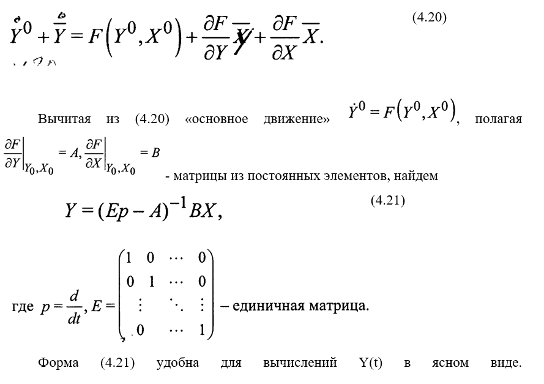

# Вопрос 21: В чём состоит задача упрощения ММ КФС?
___

Для реализации математической модели метауровня (метомодели) на практике необходимо произвести ее упрощение, естественно, при этом не потерять сути.  Проектировщики работают с упрощёнными моделями, поскольку полные модели чрезвычайно сложно обозревать, трудно обрабатывать и т.д.

Пример неупрощённой системы:

$$\Phi(Y^{(n)}, Y^{(n-1)}, ..., Y, \wedge , X) = 0$$											(1)

где $$\Phi$$ - вещественная вектор - функция своих аргументов; 

$$Y = (y_1, y_2, ... , y_n)^{T}$$  - вектор искомых фазовых координат системы.

$$\begin{cases}
   Y^{1} = (y_1^{(1)}, y_2^{1}, ... , y_n^{(1)})^{T} \\
   				...			\\
   Y = (y_1, y_2, ... , y_n)^{T}
\end{cases}$$

$$Y^{(1)}(t), Y^{(2)}(t), ... , Y^{(n)}(t)$$ - случайные функции времени. Y  включает углы тангажа, крена, курса, поворота рулей и т. д

$$\wedge$$ - вектор параметров системы (параметрами являются массы, моменты инерции и т.д.)

$$X$$ - вектор возмущающих воздействий - случайных функций времени.

Начальные условия $$Y_0 , Y_0^{(1)} , ... , Y_0^{(n-1)}$$ случайные велечины.

Если $$n > 10^3$$, то система ОСДУ становится трудноразрешимой задачей на ЭВМ.
Для реализации такой ММ на практике необходимо произвести ее упрощения, естественно, при этом не потерять сути.

**Упрощение ОСДУ**

*Суть кратко: от дифферинциальных уравнений в частных производных перейти к обыкновынным полным, потом к упрощённым уровнениям. Некоторые параметры несущественны. *

1. Избавимся от массива начальных условий (н. у.) путем замены переменных:

$$Z = Y - Y_0$$

$$Z^{(1)} = Y^{(1)} - Y_0^{(n-1)}$$
			...
$$Z^{(n-1)} = Y^{(n-1)} - Y_0^{(n-1)}$$

тогда при $$t = t_0$$ получим н.у. по $$Z$$:

$$Z_0 = 0$$

$$Z_0^{1} = 0$$

		...

$$Z_0^{n-1} = 0$$

Переходим от системы (1) к системе уравнений: 

$$tag{2} \Phi(Z^{n}, Z, \mu, X) = 0$$

где $$\mu$$ - расширенный вектор параметров, 

$$\mu = ({\wedge}, Z_0, Z_0^{1} , ... , Z_0^{n+1})$$

2)избавимся от случайных процессов $$X(t)$$ заменой переменных

$$tag{3} X_i(t) = \sum{\mathclap{j=1}}^{m} A_j sin \Omega_jt$$

где $$A_j , \Omega_jt$$ - случайные величины. Представление (3) выше основано на известных разложениях случайного процесса на сумму известных функций с параметрами случайными величинами. С помощью замены (3) вместо системы (2) получаем	

$$tag{4} \Phi(Z^{n}, ... , Z, v, X) = 0$$

$$v = (\mu , A_1 ... A_m, \Omega_1, ... , \Omega_m)$$

где $$v$$ - новый расширенный вектор параметров.

Таким образом случайные процессы заменены на случайные величины. Случайные величины на ЭВМ воспроизводятся известными генераторами случайных величин.
Наиболее удобной формой ММ для «решателя» является форма Коши.

$$\.{Y} = F(Y, v, X)$$

или для упрощения записи, опуская вектор параметров v:

$$\.{Y} = F(Y, X)$$

Если система (4) разрешима относительно старшей производной

$$Z^{(n)} = \Phi (Z^{(n-1)}, Z^{(n-2)}, ... , Z, v, X)$$

то ее можно привести к форме Коши простой заменой переменных:

$$\begin{cases}
   \.{Z} = Z_1 \\
   \.{Z_1} = Z_2 \\
   ... \\
   \.{Z_n} = \Phi(Z_1, Z_2, ... , Z_n, v, X)
\end{cases} $$

где $$Z_1, Z_2, ... , Z_n$$ - векторы из первых производных.

В целях упрощения полученную систему представляют в линейной форме:	

$$\.Y = AY + BX$$

где $$A, B$$ = $$n × n$$ матрицы из постоянных элементов.

Покажем такую линеаризацию на классической форме путем линеаризации нелинейных функций :

$$F = (Y, X): Y = Y^{0} + \={Y}$,  X = X^{0} + \={X}$$

где $$Y^{0}, X^{0}$$ -  - основное движение, а $$\={Y} , \={X}$$ - отклонения от основного движения в предположении.

Применив разложения в ряд Тэйлора, найдем: 

Например, если траектория движения  просчитана, то $$Y^{0}(t),  X^{0}(t)$$  известны и можно составить уравнение в малых отклонениях от основного движения:	

