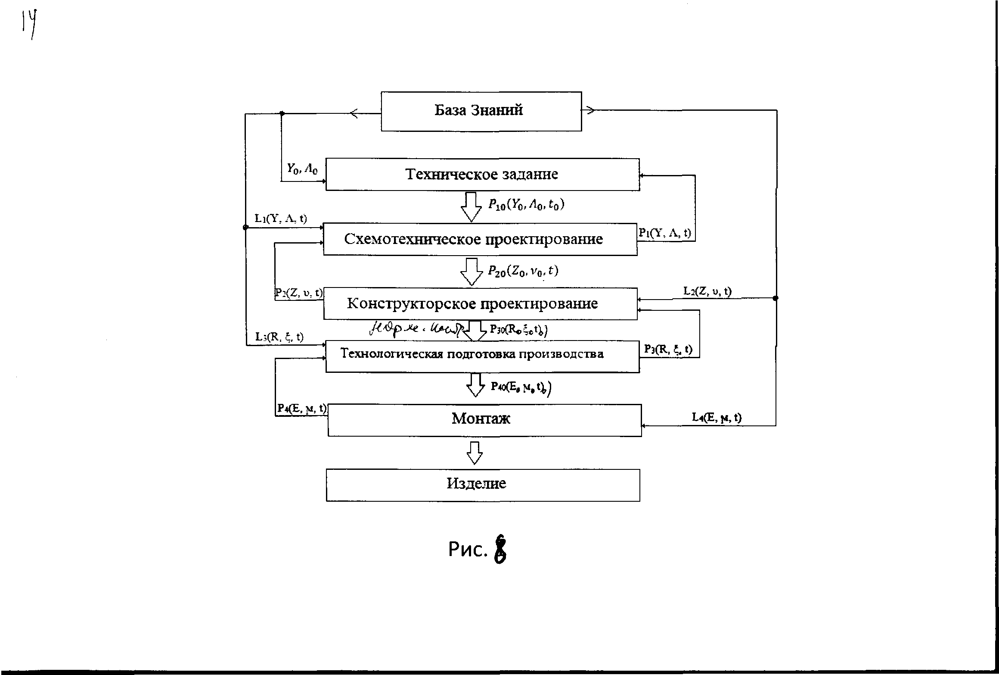

___
# Вопрос 30: Какая последовательность применения вероятностных оценок в процессе проектирования и производства КФС?
___

Начальные плотности вероятности распределения случайных функций $$ P_0(Y_0, {\Lambda}_0, t_0)  $$(ПВРСФ)   случайных величин (ПВРСВ) задаются по априорным данным (Т.З., «пересчет» ПВРСВ предыдущих параметров, в $$ \Lambda $$  по результатам конструкторских расчетов ПВРСВ и как пересчёт предыдущих параметров, $$ \xi $$ , полученных по результатам испытаний; ПВРСВ как пересчёт $$ \xi $$  по предыдущим ПВРСВ $$ \mu $$ полученным по техническим характеристикам комплектующих;

$$ L_1, L_2, L_3,L_4 $$ - операторы, ( математические модели) объекта проектирования на соотвествующих этапах.	

$$ P_{10}, P_{20}, P_{30}, P_{40} $$- начальные значения соответствующих плотностей вероятностей.

Y,Z,R,E – выходные переменные на соотвествующих этапах, случацные функии, макропеременные подлежающие изменению (оценке).

**Информация с консультации:**

Предположим, на этапе каком-то проектирования необходимо определить находится ли переменная, по которой оценивается точность, в пределах допуска или нет - это вероятностная характеристика. Эта ВХ движется от начала до конца процесса. Через плотность распределения вероятности можно определить работоспособность КФС. 

Если известна плотность вероятности распределения то определенный интеграл от нее дает вероятность, а это и есть оценка работоспособности.

Если измеряемая переменная находится в пределах допуска - система работоспособна.
